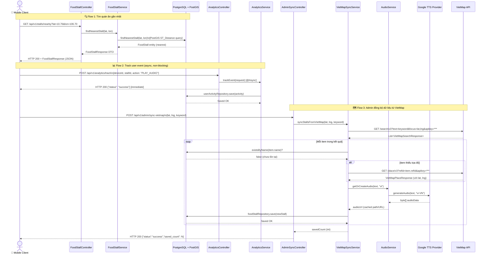

# 📄 Product Requirements Document (PRD)
# Street Voice — Hệ thống Hướng dẫn Âm thanh Ẩm thực Đường phố

---

| Thuộc tính | Giá trị |
|---|---|
| **Phiên bản tài liệu** | v1.0.0 |
| **Ngày soạn thảo** | 09/03/2026 |
| **Trạng thái** | Draft — In Review |
| **Author** | Senior PM / Technical Architect |
| **Tech Stack** | Java 21 · Spring Boot 3.2 · PostgreSQL + PostGIS · Docker |
| **Repository** | `street-voice-backend` |

---

## Mục lục

1. [Tổng quan sản phẩm (Product Overview)](#1-tổng-quan-sản-phẩm)
2. [Use Cases & User Stories](#2-use-cases--user-stories)
3. [Sơ đồ hệ thống (System Diagrams)](#3-sơ-đồ-hệ-thống)
4. [Yêu cầu hệ thống (Requirements)](#4-yêu-cầu-hệ-thống)
5. [Chiến lược kiểm thử & Test Cases](#5-chiến-lược-kiểm-thử--test-cases)
6. [Rủi ro & Giới hạn](#6-rủi-ro--giới-hạn)

---

## 1. Tổng quan sản phẩm

### 1.1 Product Vision

> **"Street Voice"** là nền tảng hướng dẫn âm thanh dựa trên vị trí địa lý (Location-based Audio Guide), cho phép người dùng di động **khám phá ẩm thực đường phố** một cách tự nhiên và trực quan thông qua giọng nói tổng hợp (TTS) — không cần nhìn vào màn hình, không cần gõ phím.

### 1.2 Product Objectives

| # | Mục tiêu | Chỉ số đo lường (KPI) |
|---|---|---|
| O1 | Cung cấp trải nghiệm khám phá quán ăn "hands-free" cho người dùng khi di chuyển | ≥ 70% session có ít nhất 1 sự kiện `PLAY_AUDIO` |
| O2 | Dữ liệu địa điểm luôn được cập nhật và chính xác thông qua đồng bộ VietMap | Độ trễ đồng bộ dữ liệu ≤ 24h |
| O3 | Hỗ trợ nhà vận hành (Admin) quản lý dữ liệu POI hiệu quả, không cần viết SQL | Admin hoàn thành tác vụ sync trong < 2 phút |
| O4 | Thu thập dữ liệu hành vi người dùng để cải thiện nội dung và đề xuất cá nhân hóa | Analytics pipeline ghi nhận ≥ 99% sự kiện người dùng |

### 1.3 User Personas

---

#### 🧳 Persona 1 — Anh Minh, Khách du lịch nội địa (28 tuổi)

**Bối cảnh:** Anh Minh đến TP.HCM công tác 2 ngày. Anh không rành đường, không muốn lãng phí thời gian đọc review online. Anh muốn một "người địa phương ảo" có thể thì thầm vào tai mình khi đi ngang qua một quán ăn ngon.

**Mục tiêu:** Tìm được quán ăn ngon, đặc trưng vùng miền, trong bán kính đi bộ.

**Pain Points:**
- Ứng dụng bản đồ truyền thống đòi hỏi nhiều thao tác chạm/gõ.
- Không biết mình có đang "bỏ lỡ" một quán ngon nào ngay gần đó không.

**Behavior:** Thường cắm tai nghe khi di chuyển. Tin tưởng vào audio hơn là đọc text dài. Muốn thông tin ngắn gọn, súc tích trong 15–30 giây.

---

#### 🛵 Persona 2 — Chị Hà, Người đi đường thường xuyên (35 tuổi)

**Bối cảnh:** Chị Hà chạy xe máy mỗi ngày qua nhiều tuyến phố ở Hà Nội. Chị muốn biết đoạn đường nào có quán ăn ngon để ghé sau khi tan làm, nhưng không thể nhìn điện thoại khi đang lái xe.

**Mục tiêu:** Nhận thông báo âm thanh thụ động khi đi qua khu vực có quán ăn tốt.

**Pain Points:**
- Không an toàn khi tương tác với điện thoại trong lúc lái xe.
- Các ứng dụng hiện tại đều yêu cầu tương tác chủ động (mở app, tìm kiếm).

**Behavior:** Kỳ vọng hệ thống tự động phát hiện khi vào vùng địa lý của quán và tự phát audio. Ưu tiên trải nghiệm "zero-touch".

---

#### 🛠️ Persona 3 — Anh Tuấn, Admin / Content Operator (42 tuổi)

**Bối cảnh:** Anh Tuấn chịu trách nhiệm duy trì tính chính xác và đầy đủ của dữ liệu quán ăn trong hệ thống. Anh cần công cụ để nhập liệu hàng loạt và đồng bộ dữ liệu từ các nguồn bên ngoài.

**Mục tiêu:** Quản lý và mở rộng kho dữ liệu POI một cách nhanh chóng, không cần lập trình.

**Pain Points:**
- Nhập liệu thủ công tốn thời gian và dễ sai sót.
- Khó kiểm soát chất lượng audio tự động được tạo ra.

---

## 2. Use Cases & User Stories

### 2.1 Danh sách Use Cases

| UC# | Use Case | Actor | Priority |
|---|---|---|---|
| UC-01 | Tìm quán ăn gần nhất theo vị trí GPS | End User | 🔴 Must Have |
| UC-02 | Xem danh sách tất cả quán ăn | End User | 🔴 Must Have |
| UC-03 | Xem chi tiết một quán ăn theo ID | End User | 🔴 Must Have |
| UC-04 | Nghe audio giới thiệu quán ăn | End User | 🔴 Must Have |
| UC-05 | Hệ thống tự động phát audio khi người dùng vào geofence | End User (passive) | 🟡 Should Have |
| UC-06 | Ghi nhận sự kiện hành vi người dùng | System / Analytics | 🔴 Must Have |
| UC-07 | Admin đồng bộ dữ liệu từ VietMap API | Admin | 🔴 Must Have |
| UC-08 | Admin nhập liệu hàng loạt (Bulk Import) | Admin | 🟡 Should Have |
| UC-09 | Admin cập nhật bán kính geofence của quán | Admin | 🟡 Should Have |
| UC-10 | Admin tạo/cập nhật/xóa quán ăn thủ công | Admin | 🟢 Nice to Have |

---

### 2.2 User Stories & Acceptance Criteria

---

#### 📍 US-01 — Tìm quán ăn gần nhất

> **As a** traveler or commuter,  
> **I want to** find the nearest food stall to my current GPS location,  
> **So that** I can quickly discover a place to eat without browsing manually.

**API Endpoint:** `GET /api/v1/stalls/nearby?lat={lat}&lon={lon}`

**Acceptance Criteria:**

- **AC-01.1:** Hệ thống nhận `lat` (vĩ độ) và `lon` (kinh độ) hợp lệ trong range `[-90,90]` và `[-180,180]`.
- **AC-01.2:** Hệ thống sử dụng PostGIS `ST_Distance` để tính khoảng cách và trả về quán ăn gần nhất trong response HTTP 200 với đầy đủ thông tin (`id`, `name`, `description`, `audioUrl`, `distance`).
- **AC-01.3:** Nếu không có quán ăn nào trong database, hệ thống trả về HTTP 404 với message rõ ràng: `"Không tìm thấy quán ăn gần nhất"`.
- **AC-01.4:** Nếu `lat` hoặc `lon` bị thiếu hoặc không hợp lệ (ví dụ `lat=999`), hệ thống trả về HTTP 400 với thông tin lỗi validation chi tiết.
- **AC-01.5:** Thời gian phản hồi của endpoint này phải `≤ 300ms` cho database có ≤ 10,000 bản ghi.

---

#### 🔊 US-02 — Nghe audio giới thiệu quán ăn

> **As a** user who has found a food stall,  
> **I want to** play an audio introduction of the stall,  
> **So that** I can learn about the stall hands-free without reading text.

**Luồng:** Người dùng lấy `audioUrl` từ `FoodStallResponse`, sau đó mobile app tự stream URL đó.

**Acceptance Criteria:**

- **AC-02.1:** Mỗi `FoodStallResponse` phải chứa trường `audioUrl` là một URL trỏ đến file audio hợp lệ (đã được tạo sẵn bởi `AudioService`).
- **AC-02.2:** `AudioService.getOrCreateAudio()` phải ưu tiên trả về audio đã được cache (từ storage/disk) trước khi gọi Google TTS API, nhằm tránh phát sinh chi phí và giảm latency.
- **AC-02.3:** Nếu Google TTS API không phản hồi hoặc trả về lỗi (quota exceeded, network timeout), hệ thống phải ghi log lỗi và có cơ chế fallback (ví dụ: trả về URL audio mặc định hoặc `null` với thông báo rõ ràng) thay vì làm crash toàn bộ luồng sync.
- **AC-02.4:** Audio phải được tổng hợp bằng ngôn ngữ `vi-VN` (tiếng Việt) với nội dung dựa trên `name` và `description` của quán.

---

#### 📊 US-03 — Ghi nhận sự kiện Analytics

> **As a** mobile app,  
> **I want to** track user interaction events (view, play, stop, finish audio),  
> **So that** the product team can analyze engagement and improve content.

**API Endpoint:** `POST /api/v1/analytics/track`

**Acceptance Criteria:**

- **AC-03.1:** Endpoint chấp nhận payload JSON gồm: `deviceId` (not blank), `stallId` (not null), `action` (một trong `VIEW_DETAILS`, `PLAY_AUDIO`, `STOP_AUDIO`, `FINISH_AUDIO`, `ENTER_REGION`, `AUTO_PLAY`), và `duration` (optional, đơn vị giây).
- **AC-03.2:** `AnalyticsService.trackEvent()` phải thực thi **bất đồng bộ** (`@Async`) để không block API response trả về client.
- **AC-03.3:** Hệ thống luôn trả về HTTP 200 `{"status": "success"}` ngay lập tức, ngay cả khi quá trình lưu analytics bị lỗi nội bộ (lỗi chỉ được ghi vào log, không ném ra client).
- **AC-03.4:** Nếu `stallId` không tồn tại trong database, lỗi `ResourceNotFoundException` phải được bắt nội bộ và ghi log, không trả về HTTP 4xx cho client.
- **AC-03.5:** Dữ liệu phải được persisted vào bảng `user_activities` với đầy đủ các trường: `device_id`, `food_stall_id`, `action_type`, `duration_seconds`, `created_at`.

---

#### 🗺️ US-04 — Admin đồng bộ dữ liệu từ VietMap

> **As an** admin operator,  
> **I want to** sync food stall data from VietMap API by keyword and location,  
> **So that** the database is always up-to-date with real-world POI data without manual entry.

**API Endpoint:** `POST /api/v1/admin/sync-vietmap`

**Request Body:**
```json
{
  "lat": 10.762622,
  "lng": 106.700174,
  "keyword": "quán bún bò"
}
```

**Acceptance Criteria:**

- **AC-04.1:** Service gọi VietMap Search API `/search/v3` với đúng `apikey`, `text` (keyword), và `focus` (lat,lng).
- **AC-04.2:** Với mỗi kết quả trả về từ VietMap, nếu quán đã tồn tại trong DB (kiểm tra theo `name`), hệ thống phải bỏ qua (deduplication) và không tạo bản ghi trùng lặp.
- **AC-04.3:** Nếu kết quả từ VietMap thiếu tọa độ (`lat`/`lng` là null), hệ thống phải tự động gọi thêm VietMap Place Detail API `/place/v3` với `refid` để lấy tọa độ bổ sung.
- **AC-04.4:** Sau khi lưu quán vào DB, hệ thống phải tự động gọi `AudioService.getOrCreateAudio()` để tạo file audio giới thiệu cho quán đó.
- **AC-04.5:** API phải trả về response JSON với `saved_count` (số lượng quán được lưu mới) và `status`.
- **AC-04.6:** Mỗi item bị lỗi trong quá trình xử lý phải được ghi log riêng lẻ và không làm dừng quá trình xử lý các item còn lại (fault isolation).

---

#### 🏗️ US-05 — Admin cập nhật Geofence

> **As an** admin operator,  
> **I want to** update the trigger radius (geofence) of a specific food stall,  
> **So that** I can fine-tune when the audio notification is triggered for users passing by.

**API Endpoint:** `PATCH /api/v1/admin/stores/{id}/geofence`

**Acceptance Criteria:**

- **AC-05.1:** Endpoint nhận `id` của quán trong path và `latitude`, `longitude`, `triggerRadius` trong request body.
- **AC-05.2:** Nếu `id` không tồn tại, trả về HTTP 404 với message `"Quan an khong ton tai: {id}"`.
- **AC-05.3:** Sau khi cập nhật, response phải trả về `FoodStallResponse` đầy đủ với dữ liệu đã được cập nhật.

---

## 3. Sơ đồ hệ thống

### 3.1 Activity Diagram — Luồng người dùng khám phá và nghe audio

```mermaid
flowchart TD
    A([Người dùng mở App]) --> B[App yêu cầu quyền truy cập GPS]
    B --> C{Người dùng\ncấp quyền?}
    C -- Không --> D[Hiển thị thông báo\nyêu cầu bật GPS]
    D --> B
    C -- Có --> E[App lấy tọa độ GPS hiện tại\nlat, lon]
    E --> F[Gọi API:\nGET /api/v1/stalls/nearby?lat=&lon=]
    F --> G{Server tìm thấy\nquán gần nhất?}
    G -- Không --> H[Hiển thị thông báo:\n'Không có quán ăn trong khu vực này']
    H --> I([Kết thúc])
    G -- Có --> J[Hiển thị danh sách quán\nvới tên, khoảng cách, hình ảnh]
    J --> K[Người dùng chọn một quán]
    K --> L[Gọi API:\nGET /api/v1/stalls/{id}]
    L --> M[Hiển thị màn hình chi tiết quán\nTên, địa chỉ, mô tả, giá]
    M --> N[Gửi Analytics Event:\nPOST /api/v1/analytics/track\naction=VIEW_DETAILS]
    N --> O[Hiển thị nút 'Nghe Giới Thiệu']
    O --> P[Người dùng nhấn nút Play]
    P --> Q[App stream audio từ audioUrl\ncó trong FoodStallResponse]
    Q --> R[Gửi Analytics Event:\naction=PLAY_AUDIO]
    R --> S{Người dùng\nkết thúc audio?}
    S -- Dừng giữa chừng --> T[Gửi Event: STOP_AUDIO\nvới duration_seconds]
    S -- Nghe hết --> U[Gửi Event: FINISH_AUDIO]
    T --> V([Kết thúc phiên])
    U --> V
```

---

### 3.2 Sequence Diagram — Backend Flow: Tìm quán & Đồng bộ VietMap



---

## 4. Yêu cầu hệ thống

### 4.1 Functional Requirements

#### FR-01 — Quản lý Quán ăn (Food Stall CRUD)

| ID | Mô tả yêu cầu | API Endpoint | HTTP Method |
|---|---|---|---|
| FR-01.1 | Lấy danh sách tất cả quán ăn | `/api/v1/stalls` | GET |
| FR-01.2 | Lấy chi tiết một quán ăn theo ID | `/api/v1/stalls/{id}` | GET |
| FR-01.3 | Tìm quán ăn gần nhất theo tọa độ GPS | `/api/v1/stalls/nearby` | GET |
| FR-01.4 | Tạo mới một quán ăn | `/api/v1/stalls` | POST |
| FR-01.5 | Cập nhật thông tin quán ăn | `/api/v1/stalls/{id}` | PUT |
| FR-01.6 | Xóa quán ăn | `/api/v1/stalls/{id}` | DELETE |

#### FR-02 — Dịch vụ Audio (TTS)

| ID | Mô tả yêu cầu |
|---|---|
| FR-02.1 | Hệ thống phải có khả năng chuyển đổi văn bản mô tả quán ăn thành file audio (TTS) thông qua `GoogleTTSProvider`. |
| FR-02.2 | `AudioService` phải implement cơ chế cache để không gọi lại TTS API nếu audio đã được tạo trước đó cho cùng một nội dung (idempotent). |
| FR-02.3 | `AudioService` phải tuân thủ pattern Strategy (`AudioProviderStrategy`) để hỗ trợ hoán đổi TTS provider trong tương lai (ví dụ: FPT AI, AWS Polly). |

#### FR-03 — Đồng bộ dữ liệu VietMap

| ID | Mô tả yêu cầu |
|---|---|
| FR-03.1 | `VietMapSyncService` phải hỗ trợ tìm kiếm địa điểm theo từ khóa (`keyword`) và vị trí trung tâm (`lat`, `lng`). |
| FR-03.2 | Hệ thống phải tự động tạo audio cho mỗi quán mới được đồng bộ từ VietMap. |
| FR-03.3 | Hệ thống phải bỏ qua các quán đã tồn tại trong DB (deduplication theo `name`). |
| FR-03.4 | Admin phải có thể kích hoạt đồng bộ VietMap qua HTTP API (`POST /api/v1/admin/sync-vietmap`). |
| FR-03.5 | Admin phải có thể nhập liệu hàng loạt dữ liệu quán ăn qua file import (`POST /api/v1/admin/import`). |

#### FR-04 — Analytics & Tracking

| ID | Mô tả yêu cầu |
|---|---|
| FR-04.1 | Hệ thống phải ghi nhận các sự kiện hành vi người dùng: `VIEW_DETAILS`, `PLAY_AUDIO`, `STOP_AUDIO`, `FINISH_AUDIO`, `ENTER_REGION`, `AUTO_PLAY`. |
| FR-04.2 | Mỗi sự kiện phải được gắn với `deviceId` (anonymous), `stallId`, và `timestamp`. |
| FR-04.3 | Quá trình lưu analytics phải bất đồng bộ, không ảnh hưởng đến response time của các API chính. |

#### FR-05 — Geofence Management

| ID | Mô tả yêu cầu |
|---|---|
| FR-05.1 | Mỗi quán ăn phải có một `triggerRadius` (đơn vị: mét) định nghĩa bán kính geofence kích hoạt audio. |
| FR-05.2 | Admin phải có thể cập nhật `triggerRadius` và tọa độ anchor point của từng quán riêng lẻ. |

---

### 4.2 Non-Functional Requirements

#### NFR-01 — Hiệu năng (Performance)

| ID | Yêu cầu | Ngưỡng |
|---|---|---|
| NFR-01.1 | **API Latency (P95)** cho endpoint `/nearby` (PostGIS query) | `≤ 300ms` |
| NFR-01.2 | **API Latency (P95)** cho các endpoint `GET` thông thường | `≤ 150ms` |
| NFR-01.3 | **Analytics write latency** (async) | Không ảnh hưởng đến response của API chính |
| NFR-01.4 | **TTS Generation time** (mocked hiện tại) | `≤ 2s` khi tích hợp Google TTS thật |

#### NFR-02 — Khả năng mở rộng (Scalability)

| ID | Yêu cầu |
|---|---|
| NFR-02.1 | Database phải có **spatial index** (GiST index) trên cột `location` (geometry) của bảng `food_stalls` để đảm bảo PostGIS query scale được. |
| NFR-02.2 | `AnalyticsService` chạy với `@Async` trên thread pool riêng biệt; cần cấu hình `ThreadPoolTaskExecutor` với `corePoolSize`, `maxPoolSize` phù hợp để tránh thread starvation. |
| NFR-02.3 | Ứng dụng phải chạy được trong môi trường containerized (Docker) và có khả năng scale horizontal (nhiều instance) thông qua load balancer. |
| NFR-02.4 | Audio file sinh ra từ TTS cần được lưu trên **object storage** (S3, GCS, hoặc tương đương), không lưu trực tiếp trong container filesystem (ephemeral storage). |

#### NFR-03 — Giới hạn API bên ngoài (Rate Limiting)

| API | Giới hạn ước tính | Chiến lược xử lý |
|---|---|---|
| **VietMap Search API** | Phụ thuộc plan (ước tính 1,000–10,000 req/ngày) | Chỉ gọi qua Admin-triggered sync, không gọi per-user-request; implement exponential backoff khi nhận HTTP 429 |
| **VietMap Place Detail API** | Tương tự Search API | Chỉ gọi khi thiếu tọa độ; cache kết quả theo `refId` |
| **Google Cloud TTS API** | 1 triệu ký tự/tháng (free tier) | Cache audio aggressively theo hash của `text+languageCode`; alert khi usage > 80% quota |

#### NFR-04 — Bảo mật (Security)

| ID | Yêu cầu |
|---|---|
| NFR-04.1 | Các endpoint Admin (`/api/v1/admin/**`) **phải được bảo vệ** bằng authentication (API Key hoặc JWT). Đây là security gap quan trọng cần giải quyết trước khi deploy production. |
| NFR-04.2 | `VIETMAP_API_KEY` và Google TTS credentials **không được** hard-code trong source code; phải được inject qua environment variables hoặc secrets manager. |
| NFR-04.3 | CORS phải được cấu hình đúng, chỉ cho phép origin từ các domain được whitelist. |

---

## 5. Chiến lược kiểm thử & Test Cases

### 5.1 Định hướng kiểm thử

**Unit Tests** (hiện có trong codebase):
- `VietMapSyncServiceTest.java`: Sử dụng `MockRestServiceServer` để mock VietMap HTTP API, kiểm tra logic sync mà không cần gọi API thật.
- Các test class khác cần bổ sung cho `FoodStallService`, `AnalyticsService`, `AudioService`.

**Integration Tests** (cần bổ sung):
- Sử dụng `@SpringBootTest` + Testcontainers (PostgreSQL + PostGIS Docker image) để test PostGIS spatial queries đầu-cuối.
- Test toàn bộ HTTP layer với `MockMvc` hoặc `TestRestTemplate`.

**Contract Tests** (đề xuất):
- Sử dụng Pact hoặc OpenAPI mock để đảm bảo contract giữa backend và mobile client không bị breaking change.

---

### 5.2 Test Cases Quan trọng

---

#### TC-01 — [POSITIVE] Tìm quán ăn gần nhất thành công

| Thuộc tính | Giá trị |
|---|---|
| **Layer** | Integration Test |
| **Endpoint** | `GET /api/v1/stalls/nearby?lat=10.762622&lon=106.700174` |
| **Pre-condition** | Database có ít nhất 1 bản ghi `FoodStall` với tọa độ hợp lệ |
| **Input** | `lat=10.762622`, `lon=106.700174` |
| **Expected Result** | HTTP 200 · Response body chứa `id`, `name`, `audioUrl` · Trường `distance` > 0 |
| **Pass Criteria** | Response time < 300ms, dữ liệu trả về khớp với bản ghi gần nhất trong DB |

---

#### TC-02 — [NEGATIVE] Không tìm thấy quán ăn nào (DB trống)

| Thuộc tính | Giá trị |
|---|---|
| **Layer** | Integration Test |
| **Endpoint** | `GET /api/v1/stalls/nearby?lat=10.762622&lon=106.700174` |
| **Pre-condition** | Database `food_stalls` rỗng (0 bản ghi) |
| **Input** | `lat=10.762622`, `lon=106.700174` |
| **Expected Result** | HTTP 404 · Response body: `{"error": "Khong tim thay quan an gan nhat"}` |
| **Pass Criteria** | Không có exception 500 · Message lỗi có ý nghĩa với client |

---

#### TC-03 — [NEGATIVE] Google TTS hết quota (429 / Resource Exhausted)

| Thuộc tính | Giá trị |
|---|---|
| **Layer** | Unit Test (`AudioService`) |
| **Method** | `audioService.getOrCreateAudio(text, "vi")` |
| **Pre-condition** | `GoogleTTSProvider.generateAudio()` được mock để throw `RuntimeException("TTS quota exceeded")` |
| **Input** | `text = "Gioi thieu quan Pho Bo Hanoi"` |
| **Expected Result** | Hệ thống bắt exception, ghi log lỗi, và trả về giá trị fallback (ví dụ: `null` hoặc URL audio mặc định) · Không throw exception ra ngoài |
| **Pass Criteria** | VietMapSyncService tiếp tục xử lý các item khác · Không có HTTP 500 cho Admin API |

---

#### TC-04 — [NEGATIVE] VietMap API trả về danh sách rỗng

| Thuộc tính | Giá trị |
|---|---|
| **Layer** | Unit Test (`VietMapSyncServiceTest`) |
| **Method** | `syncService.syncStallsFromVietMap(lat, lng, keyword)` |
| **Pre-condition** | MockRestServiceServer trả về `[]` (mảng rỗng) |
| **Input** | `lat=10.0`, `lng=106.0`, `keyword="quán ăn đặc biệt không tồn tại"` |
| **Expected Result** | Method trả về `0` · Không có bản ghi nào được lưu vào DB · Không có lỗi exception |
| **Pass Criteria** | Log message thông báo "Không tìm thấy kết quả" · `foodStallRepository.save()` không được gọi |

---

#### TC-05 — [NEGATIVE] Gửi Analytics event với input không hợp lệ

| Thuộc tính | Giá trị |
|---|---|
| **Layer** | Integration Test (`AnalyticsController`) |
| **Endpoint** | `POST /api/v1/analytics/track` |
| **Pre-condition** | N/A |
| **Input** | `{"deviceId": "", "stallId": null, "action": "INVALID_ACTION"}` |
| **Expected Result** | HTTP 400 với danh sách lỗi validation: `deviceId` không được rỗng, `stallId` không được null, `action` không hợp lệ |
| **Pass Criteria** | `AnalyticsService.trackEvent()` không được gọi · Response 400 có `errors` array chi tiết |

---

#### TC-06 — [POSITIVE] Deduplication khi sync VietMap

| Thuộc tính | Giá trị |
|---|---|
| **Layer** | Unit Test (`VietMapSyncServiceTest`) |
| **Method** | `syncService.syncStallsFromVietMap(lat, lng, keyword)` |
| **Pre-condition** | DB đã có quán tên "Quan Com 1" · VietMap mock trả về 1 item với tên "Quan Com 1" |
| **Input** | keyword="quan com", kết quả VietMap trả về item `name="Quan Com 1"` |
| **Expected Result** | Method trả về `0` (không lưu thêm) · `foodStallRepository.save()` không được gọi |
| **Pass Criteria** | `existsByName("Quan Com 1")` trả về `true` và item bị skip |

---

## 6. Rủi ro & Giới hạn

### 6.1 Điểm nghẽn tiềm ẩn (Bottlenecks)

---

#### ⚠️ RISK-01 — Thiếu xác thực Admin API (CRITICAL)

| Thuộc tính | Chi tiết |
|---|---|
| **Mức độ** | 🔴 Critical |
| **Mô tả** | Các endpoint `/api/v1/admin/**` hiện tại **không có bất kỳ lớp xác thực nào** (không có Spring Security). Bất kỳ ai biết URL đều có thể kích hoạt sync VietMap, xóa/sửa dữ liệu. |
| **Impact** | Data corruption, lộ API Key VietMap, phát sinh chi phí TTS không kiểm soát |
| **Đề xuất giải quyết** | Implement Spring Security với Basic Auth hoặc JWT cho admin routes. Ưu tiên trước khi deploy production. |

---

#### ⚠️ RISK-02 — Google TTS Provider là Mock (FUNCTIONAL GAP)

| Thuộc tính | Chi tiết |
|---|---|
| **Mức độ** | 🟡 High |
| **Mô tả** | `GoogleTTSProvider.generateAudio()` hiện tại là **stub/mock** (chỉ trả về byte mảng giả, sleep 500ms). Tính năng audio hoàn toàn không hoạt động trong môi trường thật. |
| **Impact** | Feature cốt lõi của sản phẩm không hoạt động. `audioUrl` được lưu trong DB sẽ là path đến file giả. |
| **Đề xuất giải quyết** | Tích hợp Google Cloud Text-to-Speech SDK thật. Cần Google Cloud credentials và object storage để lưu file audio. |

---

#### ⚠️ RISK-03 — Thiếu Spatial Index trên PostGIS

| Thuộc tính | Chi tiết |
|---|---|
| **Mức độ** | 🟡 High |
| **Mô tả** | Nếu không có GiST index trên cột `location` của bảng `food_stalls`, PostGIS `ST_Distance` query sẽ thực hiện full table scan, gây degradation nghiêm trọng khi số lượng bản ghi tăng. |
| **Impact** | Latency của `/nearby` endpoint tăng O(n) theo số lượng quán ăn. |
| **Đề xuất giải quyết** | Thêm vào schema migration: `CREATE INDEX idx_food_stalls_location ON food_stalls USING GIST (location);` |

---

#### ⚠️ RISK-04 — Không có Async Thread Pool Configuration

| Thuộc tính | Chi tiết |
|---|---|
| **Mức độ** | 🟠 Medium |
| **Mô tả** | `@Async` trong `AnalyticsService` sử dụng thread pool mặc định của Spring. Dưới tải cao (nhiều event analytics cùng lúc), thread pool mặc định có thể bị cạn kiệt (thread starvation), ảnh hưởng đến các task async khác. |
| **Impact** | Analytics events bị mất hoặc delay dưới tải cao. |
| **Đề xuất giải quyết** | Cấu hình `@EnableAsync` với một `ThreadPoolTaskExecutor` bean riêng, set `corePoolSize=5`, `maxPoolSize=20`, `queueCapacity=100`. |

---

#### ⚠️ RISK-05 — Audio File lưu trên Container Filesystem

| Thuộc tính | Chi tiết |
|---|---|
| **Mức độ** | 🟠 Medium |
| **Mô tả** | Nếu audio file được lưu trực tiếp trong container filesystem (ephemeral), toàn bộ audio sẽ bị mất khi container restart hoặc redeploy. |
| **Impact** | `audioUrl` trong DB trỏ đến file không còn tồn tại, gây lỗi 404 khi client cố stream audio. |
| **Đề xuất giải quyết** | Lưu audio file trên Google Cloud Storage hoặc AWS S3, `audioUrl` sẽ là public URL từ object storage. |

---

#### ⚠️ RISK-06 — Deduplication yếu (chỉ dựa theo `name`)

| Thuộc tính | Chi tiết |
|---|---|
| **Mức độ** | 🟢 Low |
| **Mô tả** | Logic dedup của `VietMapSyncService` chỉ kiểm tra trùng theo `name`. Hai quán khác nhau có thể có tên giống nhau (ví dụ: "Phở Hà Nội" ở nhiều địa điểm khác nhau). |
| **Impact** | Bỏ sót dữ liệu quán ăn hợp lệ. |
| **Đề xuất giải quyết** | Dùng composite key để dedup: (`name` + bán kính gần tọa độ) hoặc dùng `ref_id` từ VietMap làm external_id. |

---

### 6.2 Future Scope (Lộ trình phát triển tiếp theo)

| # | Tính năng | Mô tả | Priority |
|---|---|---|---|
| FS-01 | **Geofence Auto-Trigger** | Mobile SDK tự động phát audio khi người dùng bước vào `triggerRadius` của quán, không cần mở app | High |
| FS-02 | **Multi-language TTS** | Hỗ trợ audio bằng tiếng Anh (`en-US`) cho khách nước ngoài | Medium |
| FS-03 | **Personalized Recommendations** | Dựa trên `UserActivity` analytics để gợi ý quán ăn phù hợp sở thích | Medium |
| FS-04 | **Admin Dashboard** | Giao diện web để Admin quản lý quán ăn, xem analytics, kích hoạt sync mà không cần Postman | High |
| FS-05 | **Rating & Reviews Integration** | Tích hợp điểm đánh giá từ Google Maps hoặc nền tảng nội bộ vào nội dung audio | Low |
| FS-06 | **Event-driven Architecture** | Chuyển luồng sync và TTS sang message queue (Kafka/RabbitMQ) để xử lý bất đồng bộ hoàn toàn, tránh timeout cho Admin API | Medium |

---

*Tài liệu này được soạn thảo dựa trên phân tích cấu trúc mã nguồn `street-voice-backend`. Mọi thay đổi về architecture hoặc business logic cần được phản ánh lại vào PRD này.*

---

**Phiên bản:** 1.0.0 | **Trạng thái:** Draft | **Cập nhật lần cuối:** 09/03/2026